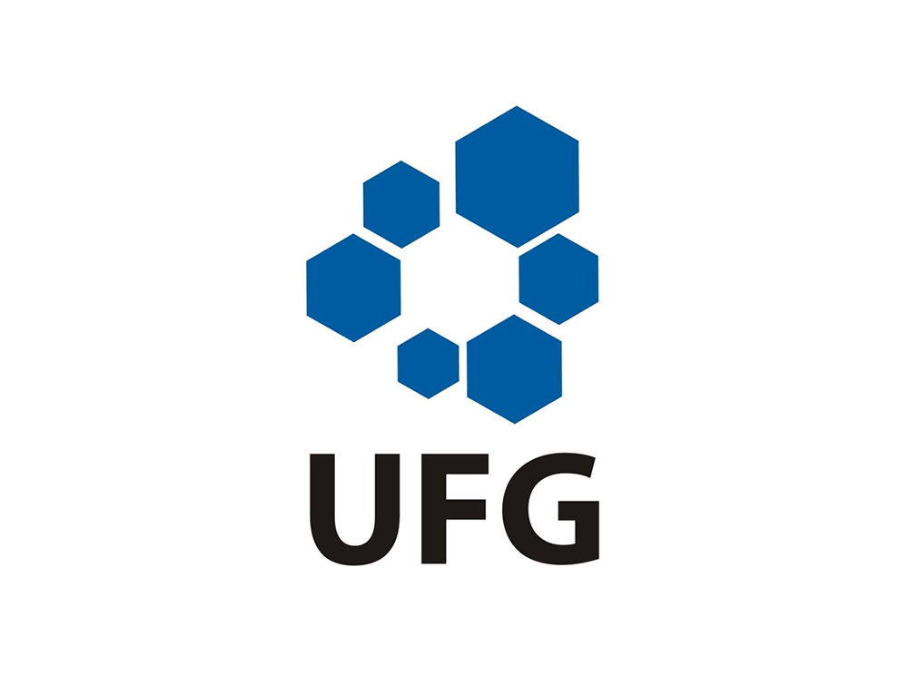

# EsteganoGO
Ferramenta de esteganografia para imagens png 
Feito por Jaime da Cruz S. Júnior

## Sobre o projeto:
- A ferramenta foi desenvolvida para a disciplina de Linguagens e Paradigmas de Programação, escrita em Golang
- Para a criação da CLI foi usado o framework [Cobra CLI](https://github.com/spf13/cobra), permitindo a criação rápida dos comandos

## Sobre a técnica de esteganografia:
- A esteganografia é uma técnica antiga usada para transmitir mensagens ocultas em diversos meios através de diferentes estratégias de mascaramento de conteúdo
- Nessa ferramenta, foi utilizado a técnica LSB (Least Signicant Bit), a qual distrui os bits que compõem a mensagem nos bits menos significativos do código RGBA
- Devido aos valores do vermelho, verde, azul e alfa serem compostos cada um por valores de 0 a 255, a alteração do bit menos significativo não altera suficientemente a imagem png de modo a tornar perceptível a olho nú
- Por meio disso, escondemos a mensagem nessa "brecha" imperceptível pelos olhos humanos
- Cabe ressaltar que há diferenças notáveis no que se refere a tamanho da imagem e código hexadecimal, os quais podem ser usados como indicativo de uma mensagem ocultada via esteganografia

## Sobre os comandos:
- Encrypt
    - Realiza a escrita da mensagem dentro da imagem passada como argumento
    - A imagem resultante tem o nome de "out.png" por padrão
    - Sintaxe:
        - `encrypt path/to/image.png -m "digite aqui a mensagem"`
- Decrypt
    - Realiza a extração da mensagem dentro da imagem e a escrita da mesma no console
    - Sintaxe: 
        - `decrypt path/to/out.png`
- Help
    - Descreve a ferramenta e os comandos, além de descrever flag caso tenha alguma
    - Sintaxe: 
        - `encrypt -h`
        - `decrypt -h`
        - `help`

## Sobre o uso:
- Para usar basta clonar o repositório e buildar
    - `go build -o build/EsteganoGo`
    - `cd build/`
    - `./EsteganoGo <comandos>`
- Você pode optar por usar o go run
    - `go run main.go <comandos>`

  
# Exemplo

| **Original** | **Modificado** |
|--------------|----------------|
||

  
## Inspiração para o trabalho:
- [SteganoGopher](https://github.com/phil-silveira/steganogopher)